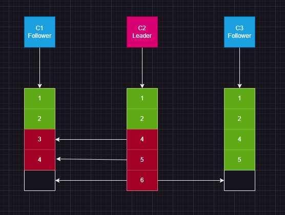
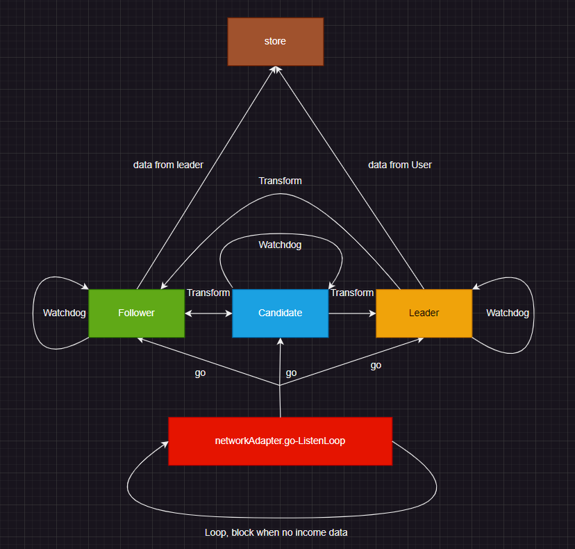
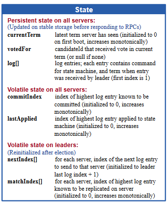
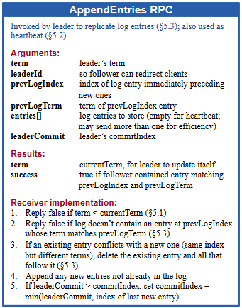
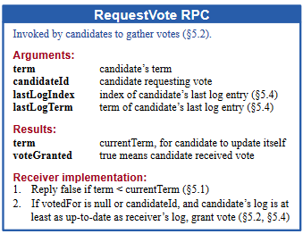
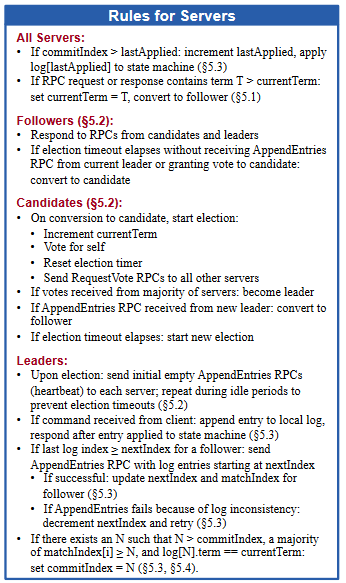

# Raft入门

Raft这一名字来源于"Reliable, Replicated, Redundant, And Fault-Tolerant"（“可靠、可复制、可冗余、可容错”）的首字母缩写。

Raft是一种用于解决分布式一致性/可用性问题的简洁协议(并不是某个软件)。相比于Paxos协议，Raft协议更加容易理和实现。

它的目标是尽可能解决其它先前的分布式协议所具有的问题，比如说——脑裂，单点故障，不一致等等。

Raft本身的目标就是为了解决集群内有限状态机的同步问题，而Raft本身工作的状态也很容易被抽象成一个有限状态机——单个机器的状态可以是领袖、追随者，或是候选人之间的任意一种，且可能会发生转换。

每个状态自身都会进行无限循环，根据接收的消息来决定是执行操作还是转换状态。

不出意外的话，候选人状态应该是持续时间最短的状态，但代码实现却是相对最复杂的。

## 如何解决脑裂问题--过半票决

假设我们现在有2n+1台服务器，但是这2n+1台服务器有些连在了不同的交换机上，内网通过交换机之间的网线传输数据，对外服务则通过路由连接到互联网。

这个时候如果出现了什么问题，比如说交换机之间的网线断了或是被人踢掉了，那么就会出现脑裂问题。

Raft协议并没有通过引入第三方的监控机制来解决问题，而是通过选举和简单的计数方式来决定分裂后的哪部分节点可以继续为用户提供服务。

简单来说，2n+1台服务器在发生脑裂后，分裂出的两个集群中，必定有一个集群中机器的数量是大于等于n+1的，而另一个集群中机器的数量一定是小于等于n的。

根据可用性的原则，我们自然会选择机器数量大于等于n+1的集群来继续为用户提供服务，而小于等于n的集群则会停止服务，以避免出现数据不一致。

要实现这样的功能，只要保证Leader在无法收到过半的follower的确认时，不会提交commit，只是阻塞并发送心跳包即可。

## 从故障中恢复——选举新的leader

网络发生故障分区的时候，如果原先的leader主机恰好分在了具有较少主机的集群中，那么具有较多主机的集群就会短暂的停止服务，并开始选举出新的leader。

而旧的leader发现自己所在的集群中主机的数量小于n时，也会停止接受请求。当然这个停止请求的部分不用我们去单独再实现，因为如果leader在提交commit时无法得到n+1个follower确认，leader就会阻塞并不再响应请求。

选举leader的部分应该算是raft协议中最复杂的部分了。

在群follower无leader的情况下，我们对每个follower设置了一个随机的超时时间。在一段时间之后，总会有一些follower的超时时间到了。那么这些follower就会转变为candidate并开始选举拉票。

拉票时，candidate会向所有的follower发送投票请求，并且附上自己的任期号、自己的最后一条log的索引。

投票的规则如下：

- follower在收到投票请求后，如果请求中的任期号大于自己的任期号，并且该任期这个follower还没有投过票，则会将自己的任期号更新为请求中的任期号，并将自己的选票投给请求中的candidate
- follower在收到投票请求后，如果请求中的任期号等于自己的任期号，且log记录的长度大于等于请求中的log记录的长度，则会将自己的投票投给请求中的candidate
- follower在收到投票请求后，如果请求中的任期号小于自己的任期号，则会拒绝投票
- 每个candidate一定会把票投给自己
- 如果candidate收到了来自其它candidate的投票请求，且自己的任期号不大于对方的任期号，则会放弃竞选并投票给对方
- 如果candidate收到了超过半数的投票，则会成为新的leader

另外，我们还需要一个超时期限来判定集群中的机器是否发生了故障，而这个期限我们通常可以通过两个时间节点来均衡：广播延迟和平均故障时间。

一般来说，在本地网络的情况下，广播时间只需要不到10ms，而平均故障时间通常是以年/月为单位的。

我们需要保证 `广播延迟 << 超时期限 << 平均故障间隔` ,同时考虑到我们希望系统从故障中恢复的时间尽可能短，因此我们把超时期限设置在20ms-500ms都算是可以接受的。

## 一致性的解决方案——log复制与两步提交

raft用来解决一致性问题的方式很简单，就是通过leader来统一管理所有的状态变更，将变更转换为log，然后将log至少同步给过半的follower后，才认为这个变更已被成功可以进行提交。

确认可以进行提交之后，leader会向所有的follower发送commit命令，follower收到commit命令后，才会将log持久化。确认持久化成功后，leader才会将log添加到自己的log栈中，并且向用户返回提交成功

当然这只是保证提交可以正常储存到集群中的机器上。如果之前断开的机器恢复了连接，或者是维护人员加入了全新的机器，那么这些机器上的数据就会和集群中的其它机器不一致。这个时候我们就需要复制日志来保证新机器的数据可以被同步。

简单来说，新机器在加入集群的时候会主动联系当前的leader,然后两者会开始匹配自身的log，直到发现了两者最晚的相同log。

查找的方式用二分查找即可，因为log是按照时间顺序排列的，所以可以通过二分查找来以$O(log\ n)$的时间复杂度找到最晚的相同log。考虑到我们是做简单实现，直接用枚举来做查找也没啥问题。

如何保证集群中log的唯一性呢？我们可以通过让leader在发送log给follower时给log加上自增id来保证log间可以被比较。如果一个follower转变成了leader，那么它的log的id就会从其目前所持有的log的最大id开始自增。

## 整体的框架实现

一个简单的raft架构图

这个图片基本是我自己在实现raft算法时所设计的程序结构。

程序在开始时首先读取配置并初始化状态机中的一些必要变量，之后默认作为Follower加入集群并向配置文件中的每个对端发送握手信息。
发送握手后，程序就进入了监听端口的无限循环，等待来自其它机器的消息。

以下是论文中关于程序数据结构的描述。实际上raft算法所包含的数据结构都不是很复杂。

参考链接：

1. [Wikipedia-Raft](https://zh.wikipedia.org/zh-cn/Raft)
2. [MIT6.824-Raft1](https://mit-public-courses-cn-translatio.gitbook.io/mit6-824/lecture-06-raft1)
3. [MIT6.824-Raft2](https://mit-public-courses-cn-translatio.gitbook.io/mit6-824/lecture-07-raft2)
